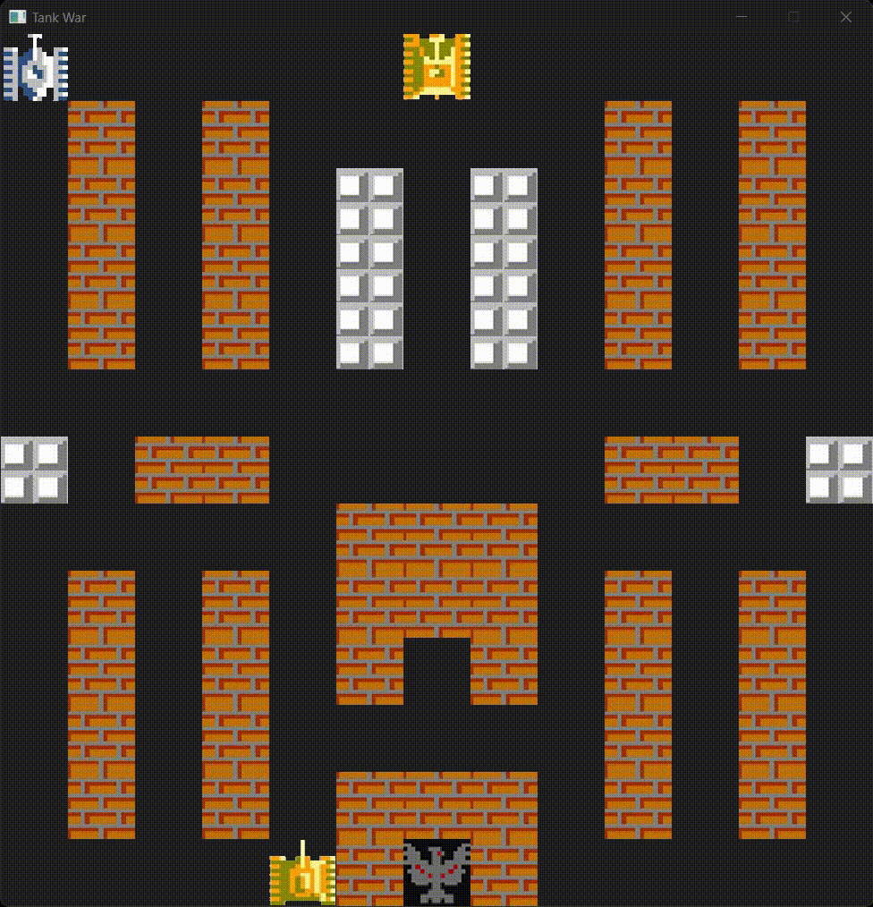

## 参考资料

- 参考项目[Tank3000](https://github.com/WuYufeng233/Tank3000)
	- 主要参考其游戏常量设置, 游戏素材
	- 类型关系网络
	- 部分游戏逻辑

- QT相关的文档
  - 官方文档
    - [MainWindow](https://doc.qt.io/qt-6/mainwindow.html)
    - [QPainter](https://doc.qt.io/qt-6/qpainter.html)
    - [QTimer](https://doc.qt.io/qt-6/qtimer.html)
    - [QRect](https://doc.qt.io/qt-6/qrect.html)
	- [QWidget::paintEvent](https://doc.qt.io/qt-6/qwidget.html#paintEvent)
	- [QWidget::update](https://doc.qt.io/qt-6/qwidget.html#update)
  - 博客
    - [QT教程__爱编程的大丙](https://subingwen.cn/qt/)

## 构建工具

- QT-6.7.1-mingw_64套件
- vscode-cmake-tools 配置的工具包如下(作为参考)
  
```json
  {
    "name": "Qt-6.7.1-mingw_64",
    "environmentVariables": {
      "VSCODE_QT_FOLDER": "d:\\Qt\\6.7.1\\mingw_64",
      "PATH": "d:\\Qt\\6.7.1\\mingw_64;d:\\Qt\\6.7.1\\mingw_64\\bin;${env:PATH};d:\\Qt\\Tools\\Ninja;d:\\Qt\\Tools\\mingw1120_64\\bin"
    },
    "isTrusted": true,
    "preferredGenerator": {
      "name": "Ninja Multi-Config"
    },
    "toolchainFile": "d:\\Qt\\6.7.1\\mingw_64\\lib\\cmake\\Qt6\\qt.toolchain.cmake",
    "compilers": {
      "C": "d:\\Qt\\Tools\\mingw1120_64\\bin\\gcc.exe",
      "CXX": "d:\\Qt\\Tools\\mingw1120_64\\bin\\g++.exe"
    }
  }
```
## 目前存在如下问题(todo list):
- [ ] 开炮间隔优化,禁止不间断开炮
  - 设定一个定时器, 开炮成功则重置定时器, 定时器到了则可以开炮
- [ ] 增加玩家升级和道具
  - 道具可以生成在任意位置(除了玩家基地附近), 不必担心和地图重叠
- [ ] 敌人AI待添加
  - [ ] 每个周期进行随机行动, 但随机数的期望为玩家基地或玩家, 这样保证敌人趋向于靠近玩家或基地
- [ ] 逻辑优化
  - [ ] 通行逻辑优化
  - [ ] 逻辑冗余: 目前存在冗余, 比如有些成员是不需要的 _position 和_geometry, 有些检测可能有重复. 比如生命和消失检测. mapseg更新函数有冗余
  - [ ] 精简碰撞代码
- [ ] 图层显示顺序问题: 比如草最后绘制, 冰面最先绘制, 坦克和炮弹在中间绘制.
  - 目前每帧中先绘制了坦克, 然后是地图. 
  - 应该将fullmap的display按地块类别拆分多个, 然后分别调用
- [ ] 移动逻辑优化
  - [ ] 优化移动逻辑, 使得能够较为平滑的移动.


## 当前版本的演示动画

```